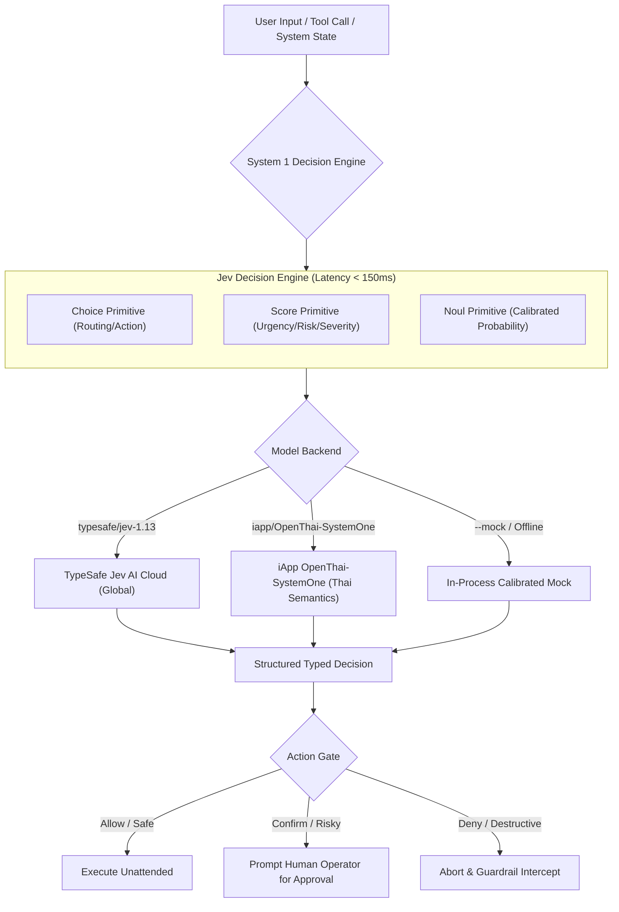

# คู่มือการใช้งาน Jev Decision Engine ฉบับสมบูรณ์ (Comprehensive User Guide) 📖

คู่มือนี้จัดทำขึ้นเพื่ออธิบายการทำงาน การติดตั้ง และการประยุกต์ใช้งาน **Jev Decision Engine (System 1 AI)** อย่างละเอียด ครอบคลุมทั้งฝั่ง **Agent Skill**, **CLI Command**, **Host-Language DSL**, **Interactive Playground** และ **สถาปัตยกรรมแบบ Dual-Model**

---

## สารบัญ (Table of Contents)

1. [แนวคิดพื้นฐาน: System 1 AI คืออะไร?](#1-แนวคิดพื้นฐาน-system-1-ai-คืออะไร)
2. [ภาพรวมสถาปัตยกรรมและการทำงาน (Architecture Overview)](#2-ภาพรวมสถาปัตยกรรมและการทำงาน-architecture-overview)
3. [3 Decision Primitives พื้นฐาน (Choice, Score, Noul)](#3-3-decision-primitives-พื้นฐาน-choice-score-noul)
4. [การติดตั้งและตั้งค่า Environment](#4-การติดตั้งและตั้งค่า-environment)
5. [การใช้งานในฐานะ AI Agent Skill](#5-การใช้งานในฐานะ-ai-agent-skill)
6. [การใช้งานผ่าน Command Line Interface (CLI)](#6-การใช้งานผ่าน-command-line-interface-cli)
7. [เจาะลึก 6 Official Playbook Presets](#7-เจาะลึก-6-official-playbook-presets)
8. [คู่มือการเขียน System 1 DSL (Python & JavaScript)](#8-คู่มือการเขียน-system-1-dsl-python--javascript)
   - [การคอมไพล์คำถามเป็น Single Pass](#การคอมไพล์คำถามเป็น-single-pass)
   - [การใช้ `.gate()` สำหรับ Threshold Check](#การใช้-gate-สำหรับ-threshold-check)
   - [การใช้ `.require()` สำหรับ Fallback Cascading](#การใช้-require-สำหรับ-fallback-cascading)
   - [การทำ Offline Unit Test ด้วย `.mock()`](#การทำ-offline-unit-test-ด้วย-mock)
9. [การใช้งานโมเดลภาษาไทย (`iapp/OpenThai-SystemOne`)](#9-การใช้งานโมเดลภาษาไทย-iappopenthai-systemone)
10. [Web Playground & Local Proxy Server](#10-web-playground--local-proxy-server)
11. [แนวปฏิบัติในการประยุกต์ใช้งานจริง (Production Best Practices)](#11-แนวปฏิบัติในการประยุกต์ใช้งานจริง-production-best-practices)

---

## 1. แนวคิดพื้นฐาน: System 1 AI คืออะไร?

ในปัจจุบัน โมเดลภาษาขนาดใหญ่ (LLMs) เช่น GPT-4, Claude หรือ Gemini ส่วนใหญ่ทำงานในลักษณะ **System 2 AI (Deliberative Reasoning)**:
- ต้องสร้างข้อความทีละโทเคน (Auto-regressive Generation)
- มีความล่าช้าสูง (Latency 1,500 – 15,000 ms)
- เอาต์พุตเป็นข้อความยาว (Prose) ที่มีโอกาสเกิด Hallucination และดึงไปประมวลผลต่อในระดับ Code ได้ยาก

**Jev Decision Engine** นำเสนอแนวคิด **System 1 AI (Fast & Intuitive Decision)**:
- ประเมินสถานะ (State) และคืนผลการตัดสินใจใน **Single Forward Pass (< 150 ms)**
- **ปลอดข้อความบรรยาย (Zero Prose):** คืนค่าเฉพาะตัวเลือกที่กำหนด ความน่าจะเป็น (Probability) และคะแนนเชิงตัวเลข
- **Type-Safe 100%:** ผลลัพธ์สอดคล้องกับ Schema ทุกครั้ง ไม่ต้องกังวลว่า JSON จะแตกหัก
- เหมาะอย่างยิ่งสำหรับการทำ **Agent Guardrails**, **Task/Model Routing**, **Triage**, และ **Security Interceptor**

---

## 2. ภาพรวมสถาปัตยกรรมและการทำงาน (Architecture Overview)



---

## 3. 3 Decision Primitives พื้นฐาน (Choice, Score, Noul)

### 3.1 Choice Primitive (`choice`)
ใช้สำหรับเลือก 1 ตัวเลือกจากชุดตัวเลือกที่กำหนดไว้ชัดเจน พร้อมคืนค่าความน่าจะเป็นของทุกตัวเลือก:
```python
# นิยามคำถามแบบ Choice
choice("Which department?", {
    "billing": "Invoices, payments, refunds",
    "tech": "Bugs, server outages",
    "account": "Logins, password reset"
})
```
- **ผลลัพธ์:** `{ "choice": "billing", "confidence": 0.98, "probabilities": { "billing": 0.98, "tech": 0.01, "account": 0.01 } }`

### 3.2 Score Primitive (`score`)
ใช้สำหรับประเมินระดับความรุนแรง หรือคะแนนที่มีการจัดลำดับ (Ordinal Scale 0 ถึง N):
```python
score("Severity level", [
    "Level 0: Low impact / cosmetic",
    "Level 1: Moderate impact / partial feature failure",
    "Level 2: Critical / severe data loss or downtime"
])
```
- **ผลลัพธ์:** `{ "score": 2.0, "legend": "Level 2: Critical", "confidence": 0.95 }`

### 3.3 Noul Primitive (`noul`)
คำว่า **Noul** มาจากเกาหลี (놀) หมายถึงการคำนวณ **ความน่าจะเป็นที่การยืนยันนี้เป็นจริง (Calibrated Probability of True 0.0 ถึง 1.0)**:
```python
noul("Does this action strictly require human confirmation before execution?")
```
- **ผลลัพธ์:** `{ "noul": 0.975 }` (ความน่าจะเป็น 97.5% ที่ต้องการคนยืนยัน)

---

## 4. การติดตั้งและตั้งค่า Environment

### ข้อกำหนดของระบบ
- **Python 3.8+** (ตัวสคริปต์ CLI `evaluate.py` ใช้เฉพาะ Standard Library 100% ไม่ต้องลง pip package เพิ่ม)
- **Node.js 18+** (สำหรับผู้ที่ต้องการใช้ JavaScript/TypeScript DSL)

### การติดตั้งลงในเครื่อง
```bash
git clone https://github.com/anusornc/jev-decision-engine.git
cd jev-decision-engine
```

### การตั้งค่า API Key
```bash
# ใส่ใน ~/.bashrc หรือ ~/.zshrc เพื่อใช้งานระยะยาว
export JEV_API_KEY="your-typesafe-jev-api-key"
export IAPP_API_KEY="your-iapp-api-key"   # ไม่บังคับ: ใส่เมื่อต้องการใช้โมเดล OpenThai บน Cloud
```

*(หมายเหตุ: หากไม่ได้ใส่ API Key ระบบจะสลับเข้าสู่ **Calibrated Mock Mode** โดยอัตโนมัติ ทำให้ทดลองใช้งานหรือเขียน Unit Test ได้โดยไม่ต้องต่ออินเทอร์เน็ต)*

---

## 5. การใช้งานในฐานะ AI Agent Skill

หากคุณใช้งาน AI Coding Agent เช่น **Google Antigravity**, **Claude Code**, หรือ **Cursor** คุณสามารถติดตั้ง Skill นี้เพื่อให้ Agent นำไปใช้ตัดสินใจก่อนรันคำสั่งได้โดยตรง:

### การติดตั้งเข้าโฟลเดอร์ Skill ของ Agent
```bash
# สำหรับ Agent ทั่วไป (Claude Code / Open Agents)
git clone https://github.com/anusornc/jev-decision-engine.git ~/.agents/skills/jev-decision-engine

# สำหรับ Google Antigravity / Gemini CLI
git clone https://github.com/anusornc/jev-decision-engine.git ~/.gemini/config/skills/jev-decision-engine
```

### กฎการประเมิน Threshold ที่ Agent ปฏิบัติตาม
Agent จะอ่านไฟล์ [`SKILL.md`](./SKILL.md) และใช้เกณฑ์ดังต่อไปนี้:
- เมื่อเจอผล `action == "deny"`: **หยุดทำงานทันที** และแจ้งเตือนผู้ใช้
- เมื่อเจอผล `action == "confirm"` หรือ `noul >= 0.85`: **หยุดรอ** และขอการยืนยันจากมนุษย์ (Human-in-the-loop)
- เมื่อเจอผล `noul < 0.40` หรือ `action == "allow"`: **รันคำสั่งได้อัตโนมัติ**

---

## 6. การใช้งานผ่าน Command Line Interface (CLI)

สคริปต์ [`scripts/evaluate.py`](./scripts/evaluate.py) เป็นเครื่องมือ CLI อิสระที่พกพาไปรันที่ไหนก็ได้

### รูปแบบคำสั่งพื้นฐาน
```bash
python3 scripts/evaluate.py --preset <ชื่อ-preset> --state "<บริบทที่ต้องการให้ประเมิน>"
```

### ตัวเลือกคำสั่งที่สำคัญ
| Parameter | คำอธิบาย | ตัวอย่าง |
| :--- | :--- | :--- |
| `--preset`, `-p` | เลือกใช้ชุดคำถามสำเร็จรูปที่มีให้ | `--preset tool_guard` |
| `--state`, `-s` | ข้อความหรือบริบทที่ต้องการให้ประเมิน | `--state "rm -rf /"` |
| `--model`, `-m` | เลือกโมเดล (`typesafe/jev-1.13` หรือ `iapp/OpenThai-SystemOne`) | `--model "iapp/OpenThai-SystemOne"` |
| `--raw` | แสดงผลลัพธ์เป็น JSON สำหรับเอาไปต่อกับสคริปต์อื่น | `--raw` |
| `--mock` | บังคับรันแบบ Mock เพื่อทดสอบโดยไม่ยิงเน็ตเวิร์ก | `--mock` |
| `--choice` | นิยามคำถาม Choice แบบกำหนดเอง | `--choice "env:dev=Development,prod=Production"` |
| `--score` | นิยามคำถาม Score แบบกำหนดเอง | `--score "risk:Low,Medium,High"` |
| `--noul` | นิยามคำถาม Noul แบบกำหนดเอง | `--noul "is_safe=Is it safe?"` |

---

## 7. เจาะลึก 6 Official Playbook Presets

สอดคล้องกับมาตรฐานของทางการ [jevai.org/th/skills](https://www.jevai.org/th/skills):

### 1. `tool_guard` (ระบบความปลอดภัยก่อนรันคำสั่ง)
ใช้ประเมินก่อนรันคำสั่ง shell หรือ tool call ที่มีความเสี่ยง:
```bash
python3 scripts/evaluate.py --preset tool_guard --state "Command: 'rm -rf /var/data/prod'"
```
- คืนค่า `action`: `allow`, `confirm`, `review`, `deny`
- คืนค่า `requires_human_approval`: ความน่าจะเป็น (Noul)
- คืนค่า `reversibility`: ความสามารถในการย้อนกลับ (0=Irreversible ถึง 2=Fully reversible)

### 2. `model_router` (การเลือกโมเดลที่คุ้มค่าและเหมาะสม)
ใช้ประเมินว่างานนี้ควรส่งต่อให้โมเดลระดับใด:
```bash
python3 scripts/evaluate.py --preset model_router --state "Task: 'Implement lock-free ring buffer in C++'"
```
- คืนค่า `model_tier`: `fast_cheap` (งานง่าย), `standard` (งานโค้ดทั่วไป), `heavy_reasoning` (งานสถาปัตยกรรม/ตรรกะซับซ้อน)

### 3. `task_router` (การควบคุมทิศทางการดำเนินงาน)
ใช้ตัดสินใจเมื่อเส้นทางการทำงานไม่ชัดเจน:
```bash
python3 scripts/evaluate.py --preset task_router --state "Task: 'Refactor monolith into 25 services'"
```
- คืนค่า `execution_path`: `proceed_fast`, `deep_review`, `split_task`, `block`

### 4. `research_guard` (การตรวจสอบข้อเท็จจริงในงานวิจัย)
ใช้ตรวจว่าข้อกล่าวอ้างมีหลักฐานอ้างอิงสนับสนุนเพียงพอหรือไม่:
```bash
python3 scripts/evaluate.py --preset research_guard --state "Claim: 'Quantum dots improve OLED by 40%'"
```
- คืนค่า `claim_status`: `accept`, `verify_more`, `reject`

### 5. `completion_review` (การตรวจสอบความสมบูรณ์ก่อนปิดงาน)
ใช้ตรวจทานก่อนสรุปงานว่าทุกอย่างเสร็จสิ้นสมบูรณ์จริง:
```bash
python3 scripts/evaluate.py --preset completion_review --state "All 15 tests pass, zero errors, docs ready"
```
- คืนค่า `completion_status`: `complete`, `verify_more`, `incomplete`

### 6. `meta_router` (Master Router)
ใช้สำหรับให้ Agent ถามว่าในจังหวะนี้ควรเรียกใช้ Playbook ใดใน 5 ตัวข้างต้น

---

## 8. คู่มือการเขียน System 1 DSL (Python & JavaScript)

### การคอมไพล์คำถามเป็น Single Pass
ตัวอย่างการสร้างฟังก์ชันตัดสินใจใน Python:
```python
from dsl.python.system1_dsl import decide, choice, noul, score

triage = decide(
    name="customer.triage",
    model="typesafe/jev-1.13",
    ask={
        "dept": choice("Department to handle", {
            "billing": "Refunds, charges, payment disputes",
            "tech": "Bugs, crashes, outages"
        }),
        "urgency": score("Urgency rating", ["Low", "Medium", "High"]),
        "needs_human": noul("Requires human supervisor?")
    }
)

# ประเมินผลข้อความใน 1 Forward Pass (< 150ms)
res = triage("Customer: 'Double charged $49 on invoice #8812, refund immediately!'")
print(f"Team: {res.dept}, Level: {res.urgency}, Human Needed: {res.needs_human}")
```

### การใช้ `.gate()` สำหรับ Threshold Check
ฟังก์ชัน `.gate(threshold)` จะแปลงค่าความน่าจะเป็นของ Noul ให้กลายเป็น Boolean (`True`/`False`) โดยอัตโนมัติตามเกณฑ์ที่กำหนด:
```python
ask = {
    # ถ้าค่าความน่าจะเป็น >= 0.85 จะได้ True ถ้าต่ำกว่าจะได้ False
    "urgent": noul("Needs immediate human attention?").gate(0.85)
}
```

### การใช้ `.require()` สำหรับ Fallback Cascading
ฟังก์ชัน `.require(min_conf, fallback)` ช่วยป้องกันความผิดพลาด หากโมเดลมีความมั่นใจต่ำกว่าเกณฑ์ ระบบจะสลับไปใช้ค่า Fallback โดยอัตโนมัติ:
```python
ask = {
    "category": choice("Task category", {
        "auth": "Authentication & security",
        "general": "General questions"
    }).require(min_conf=0.90, fallback="supervisor_escalation")
}
```

### การทำ Offline Unit Test ด้วย `.mock()`
สามารถกำหนดผลลัพธ์จำลองล่วงหน้าเพื่อเขียน Automated Test ในระบบ CI/CD โดยไม่ต้องต่อเน็ตเวิร์กและไม่เสียโควตา:
```python
triage.mock({
    "dept": {"choice": "billing", "confidence": 0.99},
    "urgent": {"noul": 0.95}
})

result = triage("ข้อความทดสอบ")
assert result.dept == "billing"
assert result.urgent is True

triage.clear_mock()
```

---

## 9. การใช้งานโมเดลภาษาไทย (`iapp/OpenThai-SystemOne`)

สำหรับงานที่ต้องเข้าใจบริบทเฉพาะตัวของภาษาไทย เช่น สแลง ข้อความร้องเรียนผู้บริโภค หรือการหลอกลวงออนไลน์ สามารถระบุโมเดล `iapp/OpenThai-SystemOne`:

```bash
python3 scripts/evaluate.py \
  --model "iapp/OpenThai-SystemOne" \
  --preset thai_complaint \
  --state "สั่งมือถือไป 12,000 บาท ได้กล่องเปล่า ร้านบล็อกหนี"
```

เอาต์พุตที่ได้:
```text
⚡ [iapp/OpenThai-SystemOne] Latency: 88 ms
-------------------------------------------------------
• [Choice] complaint_category  : fraud_scam (Confidence: 99.1%)
• [Score]  urgency_score       : 2.0 - ร้ายแรง เข้าข่ายฉ้อโกง/สูญเสียเงินจำนวนมาก
• [Noul]   escalate_legal      : 98.0% probability of YES
-------------------------------------------------------
```

---

## 10. Web Playground & Local Proxy Server

ในโฟลเดอร์ [`playground/`](./playground) มี Web UI ให้ทดลองใช้งานและปรับแต่ง Prompt แบบ Real-time:

### 1. เปิด Local Proxy Server
```bash
python3 playground/proxy.py
# Proxy จะเริ่มทำงานที่ http://localhost:8000
```

### 2. เปิดหน้าเว็บ
เปิดไฟล์ `playground/index.html` ในเบราว์เซอร์ คุณจะพบกับ:
- แท็บทดสอบ **Interactive Decision Playground**
- แท็บ **System 1 DSL (decide)** สำหรับคอมไพล์โค้ด JavaScript
- ตัวสลับโมเดลระหว่าง `typesafe/jev-1.13` และ `iapp/OpenThai-SystemOne`
- ตัววัด Latency แบบเรียลไทม์

---

## 11. แนวปฏิบัติในการประยุกต์ใช้งานจริง (Production Best Practices)

1. **อย่าส่งข้อมูลความลับ (No Secrets):** ห้ามส่ง Password, Private Key, หรือ Token บัตรเครดิตเข้าไปใน `state` ของการตัดสินใจ
2. **ใช้ System 1 นำหน้า System 2 เสมอ:** วาง Jev ไว้หน้า LLM ตัวใหญ่ เพื่อคัดกรองว่างานใดตอบได้ทันที งานใดไม่ต้องเรียก LLM ช่วยประหยัดค่า Token ได้มากกว่า 70%
3. **กำหนด Threshold ให้เหมาะสม:**
   - งานทำลายล้าง (Delete/Drop): ให้ใช้เกณฑ์ความปลอดภัยสูง `noul >= 0.85`
   - งานแนะนำหรือจัดหมวดหมู่: ใช้เกณฑ์ปานกลาง `noul >= 0.50`
4. **ทำ Unit Test เป็นประจำ:** รัน `python3 tests/test_dsl.py` และ `node tests/test_dsl.js` ทุกครั้งก่อน Deploy เพื่อการันตีความถูกต้องของ Logic การตัดสินใจ
